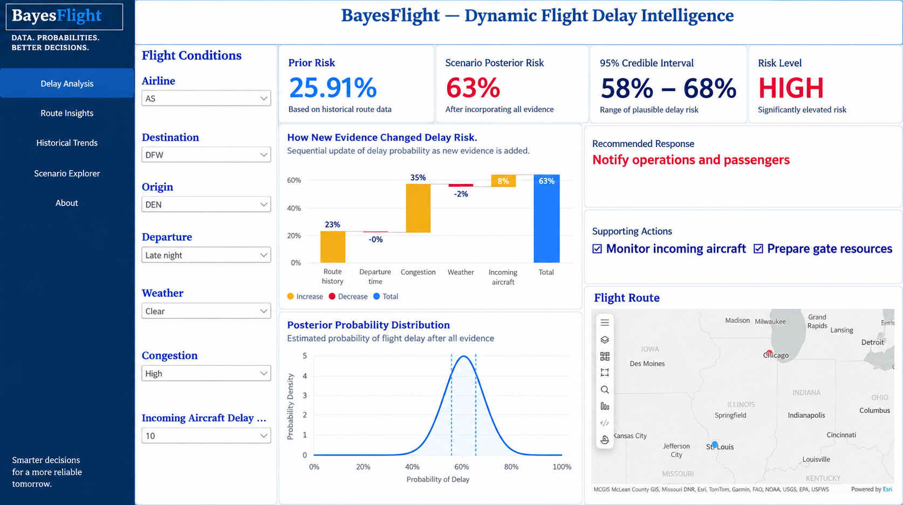

# BayesFlight — Dynamic Flight Delay Intelligence

BayesFlight is an end-to-end flight-delay decision-support project developed using **R, Bayesian analysis, and Power BI**.

R serves as the analytical engine for data preparation, risk modeling, model evaluation, uncertainty estimation, and scenario calculations. Power BI transforms those analytical outputs into an interactive dashboard for airline operations teams.

The system helps users identify high-risk flights, understand the operational factors influencing delay risk, evaluate model performance, test different flight scenarios, and determine an appropriate operational response.



## Project Objectives

BayesFlight was designed to answer five key questions:

1. What is the historical delay risk for a flight?
2. How does new operational evidence change that risk?
3. What is the plausible range of the updated delay probability?
4. Which operational factors contribute most strongly to delay risk?
5. What action should the operations team take based on the result?

## Project Workflow

The project was completed in two main stages:

1. **Data preparation, modeling, validation, and scenario calculations in R**
2. **Interactive decision-support dashboard development in Power BI**

## R Analytics and Modeling Workflow

R was used as the analytical engine behind BayesFlight.

### Data Preparation

The data-preparation workflow included:

- Importing and cleaning the flight data
- Checking missing values and variable consistency
- Standardizing operational categories
- Preparing variables for modeling and reporting
- Creating testing and validation datasets
- Producing summarized tables for Power BI

The main operational variables included:

- Reporting airline
- Origin airport
- Destination airport
- Departure period
- Distance band
- Weather severity
- Operational congestion
- Incoming-aircraft status
- Observed delay outcome

### Feature Engineering

Operational categories were prepared to make the model outputs easier to interpret and use in the dashboard.

Examples included:

- Early morning
- Morning
- Afternoon
- Evening
- Late night
- Low, moderate, and high congestion
- Weather-severity categories
- Distance-band categories
- Incoming-aircraft delay conditions

These features allowed the model to estimate how different operational conditions affected flight-delay risk.

### Delay-Risk Modeling

The R workflow estimated the probability of flight delay using historical and operational evidence.

The model generated:

- Predicted delay probabilities
- Model coefficients
- Log-odds estimates
- Odds ratios
- Lower and upper 95% uncertainty bounds
- Evidence direction
- Evidence-strength classifications

Each operational factor was classified as one of the following:

- **Increases delay risk**
- **Reduces delay risk**
- **Uncertain effect**
- **Baseline**

This classification was used to create the Risk Drivers page in Power BI.

### Bayesian Scenario Calculations

R was used to develop the scenario-analysis calculations.

The scenario process:

1. Starts with a historical prior probability of delay
2. Converts the prior probability into log odds
3. Identifies the evidence contribution associated with each selected condition
4. Adds the evidence contributions to the prior log odds
5. Converts the updated log odds back into probability
6. Produces the posterior delay-risk estimate
7. Calculates the lower and upper limits of the 95% credible interval
8. Assigns a risk-level classification
9. Generates a recommended operational response

The Bayesian relationship can be represented as:

\[
P(\text{Delay} \mid \text{Evidence})
\propto
P(\text{Evidence} \mid \text{Delay})
\times
P(\text{Delay})
\]

This approach allows BayesFlight to update the probability of delay as new operational evidence becomes available.

### Sequential Evidence Updates

R also generated the values used in the evidence-change waterfall chart.

The chart shows how the estimated delay risk changes after adding evidence related to:

- Route history
- Departure period
- Operational congestion
- Weather
- Incoming-aircraft status

This makes the posterior risk more explainable by showing the contribution of each step.

### Posterior Probability Distribution

R generated the values required to visualize the posterior probability distribution.

The distribution communicates:

- The posterior delay probability
- The lower credible-interval boundary
- The upper credible-interval boundary
- The uncertainty surrounding the final risk estimate

This prevents the dashboard from presenting the prediction as if it were perfectly certain.

### Model Evaluation

The model was evaluated separately using testing and validation data.

The evaluation metrics included:

- **ROC-AUC** — measures the model’s ability to distinguish delayed and non-delayed flights
- **PR-AUC** — evaluates precision and recall, particularly when delay outcomes are imbalanced
- **Brier score** — measures the accuracy of the predicted probabilities
- **Calibration gap** — compares predicted delay rates with observed delay rates
- **Observed delay rate**
- **Predicted delay rate**

The Model Performance page allows users to compare the predicted and observed outcomes.

### R Output Tables

R generated structured tables for use in Power BI, including:

- Dashboard KPI summaries
- Airport summaries
- Operational-condition summaries
- Alert-priority queues
- Risk-level summaries
- Route summaries
- Model-performance metrics
- Model coefficients
- Odds-ratio summaries
- Evidence-strength classifications
- Scenario-analysis values
- Posterior probability-distribution data

These tables allowed the statistical calculations to remain in R while Power BI served as the presentation and interaction layer.

## Power BI Dashboard

The Power BI report contains five main pages.

### 1. Overview

The Overview page provides a high-level summary of flight-delay performance.

It includes:

- Predicted delay rate
- Observed delay rate
- Priority-alert flights
- High- and severe-risk share
- Total flight volume
- Risk-level distribution
- Airport risk comparison
- Departure-period delay comparison
- Data-split filtering

### 2. Priority Alert Queue

The Priority Alert Queue displays flights that may require operational attention.

Users can:

- Filter flights by alert priority
- Rank flights by delay-risk score
- Review the origin and destination
- Review the departure period
- Review the distance band
- Examine the number of delayed flights
- Identify flights requiring immediate investigation

### 3. Model Performance

The Model Performance page evaluates the predictive quality and calibration of the model.

It displays:

- ROC-AUC
- PR-AUC
- Brier score
- Calibration gap
- Observed delay rate
- Predicted delay rate
- Testing and validation results

### 4. Risk Drivers

The Risk Drivers page explains how operational conditions affect the odds of a flight delay.

The visual includes:

- Median odds ratios
- Lower 95% uncertainty limits
- Upper 95% uncertainty limits
- Evidence strength
- Evidence direction

The colors distinguish between factors that:

- Increase delay risk
- Reduce delay risk
- Have an uncertain effect
- Represent the baseline

### 5. Scenario Explorer

The Scenario Explorer allows users to test operational conditions and observe how the estimated delay risk changes.

Users can select:

- Airline
- Origin
- Destination
- Departure period
- Weather conditions
- Congestion level
- Incoming-aircraft delay

The page then updates:

- Prior risk
- Posterior risk
- 95% credible interval
- Risk level
- Recommended response
- Supporting actions
- Evidence-change waterfall chart
- Posterior probability distribution
- Flight-route map

## Example Scenario

The dashboard screenshot shows the following scenario:

| Input | Selected Value |
|---|---:|
| Airline | AS |
| Origin | DEN |
| Destination | DFW |
| Departure period | Late night |
| Weather | Clear |
| Congestion | High |
| Incoming-aircraft delay | 10 minutes |

### Scenario Results

| Measure | Result |
|---|---:|
| Prior risk | 25.91% |
| Posterior risk | 63% |
| 95% credible interval | 58%–68% |
| Risk level | High |

### Recommended Response

**Notify operations and passengers**

Supporting actions include:

- Monitor the incoming aircraft
- Prepare gate resources

## Decision-Support Logic

BayesFlight does not stop at predicting whether a delay may occur.

The system connects the analytical result to a practical operational response.

Depending on the posterior risk level, the dashboard can recommend actions such as:

- Continue routine flight monitoring
- Monitor operating conditions
- Prepare contingency resources
- Monitor the incoming aircraft
- Prepare gate resources
- Notify passenger-service teams
- Notify operations and passengers

## Tools and Technologies

- R
- Bayesian statistical modeling
- Data cleaning
- Feature engineering
- Predictive probability modeling
- Model calibration and validation
- Odds-ratio interpretation
- Power BI
- DAX
- Power Query
- Data visualization
- Scenario analysis
- Decision-support design

## Key Features

- Interactive operational-condition slicers
- Bayesian probability updating
- Prior and posterior risk estimates
- Dynamic 95% credible intervals
- Risk-level classification
- Dynamic operational recommendations
- Explainable risk drivers
- Evidence-change waterfall chart
- Posterior probability distribution
- Model-performance monitoring
- Priority-alert queue
- Flight-route mapping
- Testing and validation filters

## Business Value

BayesFlight helps airline operations teams move from static reporting toward proactive decision support.

The dashboard can support:

- Earlier identification of high-risk flights
- Better allocation of gate and operational resources
- Faster communication with affected passengers
- More transparent and explainable risk estimates
- Improved understanding of model uncertainty
- Data-driven contingency planning
- Monitoring of model performance and calibration

## Repository Structure

```text
bayesflight-delay-intelligence/
├── README.md
├── Images/
│   └── Dashboard.png
├── data/
│   ├── raw/
│   └── processed/
├── R/
│   ├── data-preparation scripts
│   ├── modeling scripts
│   ├── model-evaluation scripts
│   └── Power BI export scripts
├── output/
│   ├── model-performance tables
│   ├── model-coefficient tables
│   ├── scenario tables
│   └── dashboard summaries
└── powerbi/
    └── BayesFlight dashboard file
```

## Future Improvements

Potential future improvements include:

- Real-time flight-data integration
- Live weather-data integration
- Airport-specific congestion feeds
- Automatic operational alerts
- Additional route-level predictors
- Model-drift monitoring
- Historical scenario comparison
- Cost-sensitive operational thresholds
- Power BI Service deployment
- Scheduled data refresh
- Mobile dashboard optimization

## Key Learning

The main lesson from this project is that an effective analytics product should not stop at producing a prediction.

It should also:

- Explain what changed the prediction
- Communicate the uncertainty around the estimate
- Connect the result to an operational decision
- Recommend a practical response
- Monitor whether the model remains reliable

R provided the statistical and analytical foundation, while Power BI transformed the results into an accessible decision-support tool.

## Author

**Gerald Hlabiso**  
M.S. Business Analytics Candidate  
Saint Louis University

- [LinkedIn](https://www.linkedin.com/in/gerald-hlabiso-9899a4161/)
- [Portfolio](https://gerald-hlabiso.github.io/business-analytics-portfolio/)
- [GitHub](https://github.com/gerald-hlabiso)
