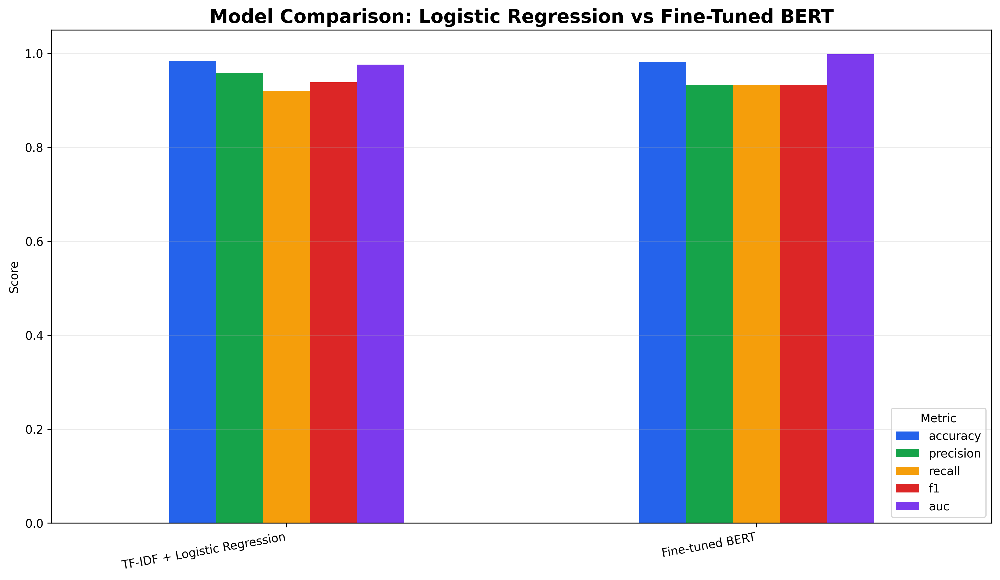
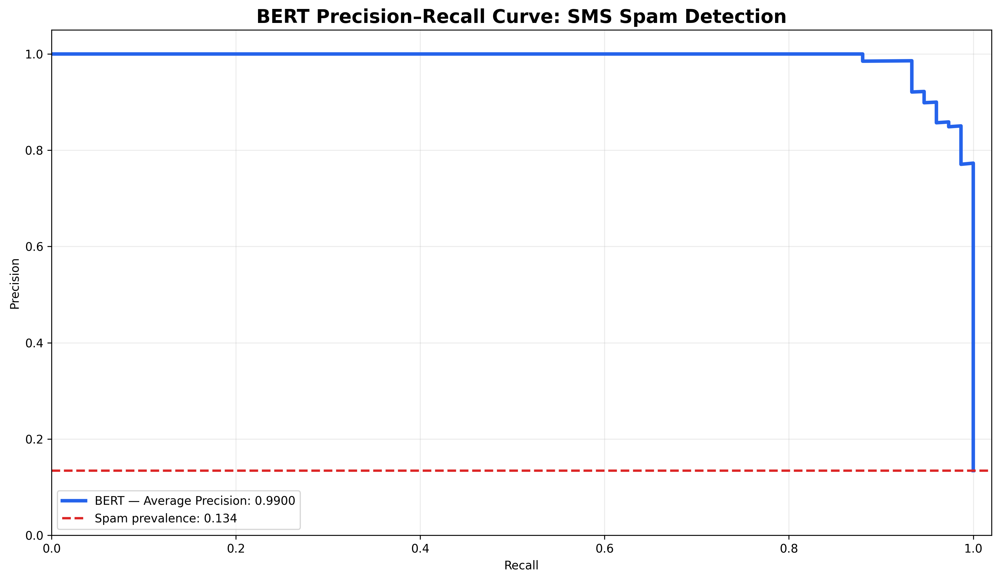
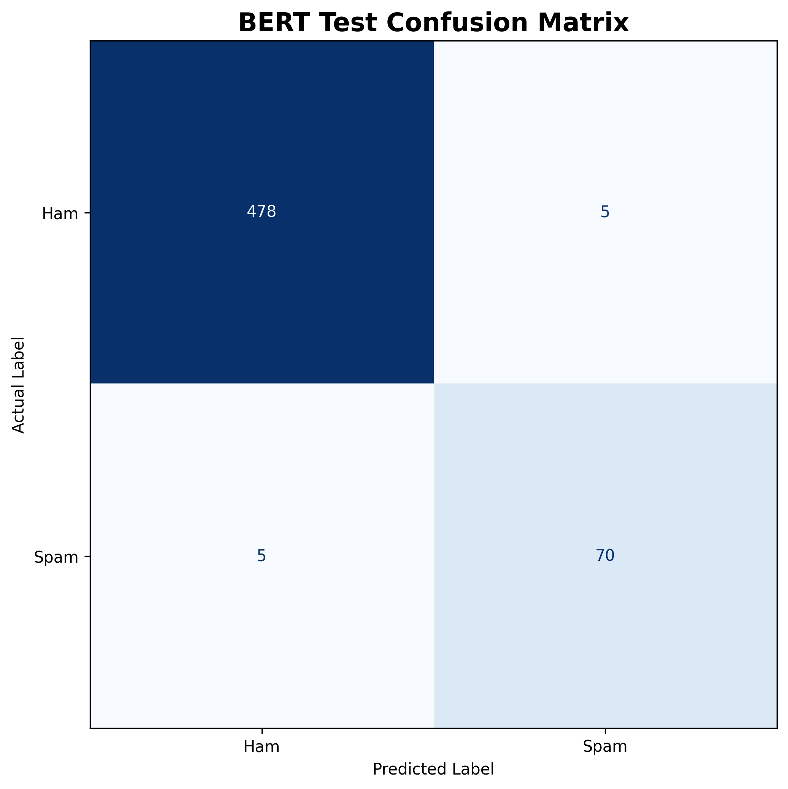
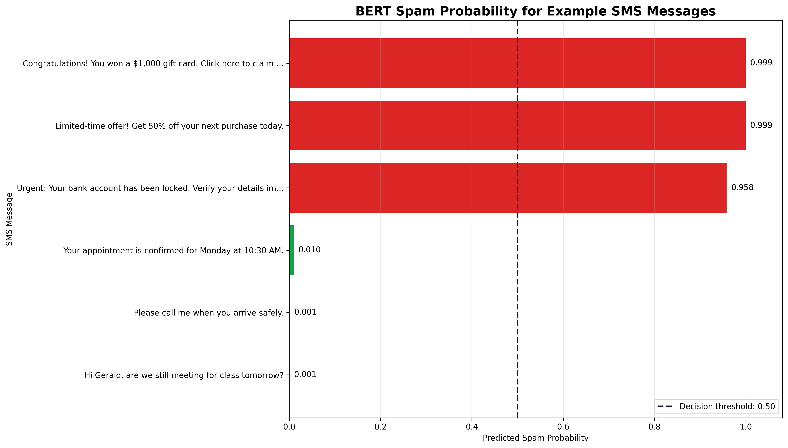

# BERT SMS Spam Detection

An end-to-end natural language processing project that fine-tunes BERT to classify SMS messages as legitimate (**ham**) or **spam**, compares it with a traditional machine-learning baseline, and evaluates the operational tradeoff between missed spam and blocked legitimate messages.

## Business Question

**Can a fine-tuned BERT model improve SMS spam detection while maintaining an acceptable balance between missed spam messages and incorrectly blocked legitimate messages?**

Spam filtering is a risk-sensitive classification problem. False negatives may expose users to phishing, fraud, and unwanted content, while false positives can block legitimate communication. Therefore, this project evaluates precision, recall, F1 score, probability ranking, threshold stability, and message-level errors rather than relying on accuracy alone.

## Project Highlights

- Fine-tuned `google-bert/bert-base-uncased` using the Hugging Face `Trainer` API
- Benchmarked BERT against TF-IDF with Logistic Regression
- Used a stratified 80/10/10 training, validation, and testing split
- Applied class-weighted cross-entropy loss to address class imbalance
- Selected the decision threshold using validation data instead of the test set
- Evaluated false positives and false negatives at the message level
- Tested the model using realistic promotional, phishing, and legitimate messages

## Dataset

The project uses the [UCI SMS Spam Collection](https://archive.ics.uci.edu/dataset/228/sms+spam+collection), accessed through the Hugging Face `ucirvine/sms_spam` dataset.

| Split | Messages | Ham | Spam |
|---|---:|---:|---:|
| Training | 4,459 | 3,861 | 598 |
| Validation | 557 | 483 | 74 |
| Test | 558 | 483 | 75 |
| **Total** | **5,574** | **4,827** | **747** |

Spam represents approximately **13.4%** of the dataset, making class-sensitive evaluation metrics especially important.

## Modeling Workflow

1. Load and validate the SMS dataset
2. Preserve class proportions using stratified sampling
3. Train a TF-IDF and Logistic Regression baseline
4. Tokenize messages using the BERT tokenizer
5. Fine-tune BERT for three epochs using class-weighted loss
6. Evaluate validation and held-out test performance
7. Analyze the precision–recall curve and decision thresholds
8. Inspect misclassified messages
9. Test realistic SMS examples
10. Interpret deployment and monitoring implications

## Results

### Fine-Tuned BERT Test Performance

| Metric | Result |
|---|---:|
| Accuracy | 98.21% |
| Spam precision | 93.33% |
| Spam recall | 93.33% |
| Spam F1 score | 93.33% |
| Average Precision | 99.00% |
| Correct predictions | 548 of 558 |
| False positives | 5 |
| False negatives | 5 |

### Validation Threshold Analysis

The selected decision threshold was **0.50**, producing:

- Precision: **97.33%**
- Recall: **98.65%**
- F1 score: **97.99%**
- False positives: **2**
- False negatives: **1**

Predictions remained unchanged across a broad range of candidate thresholds. This indicates strong probability separation for most validation messages.

## Baseline Comparison

The TF-IDF and Logistic Regression baseline remained highly competitive. It achieved slightly stronger accuracy and precision in this experiment, while BERT produced strong probability-ranking performance and captured contextual language relationships that a bag-of-words model may miss.

This is an important operational finding: the more complex model is not automatically the best deployment choice.

Logistic Regression provides a reasonable production baseline when speed, cost, and interpretability are the main priorities. BERT is a valuable challenger model when contextual understanding and future adaptability justify the additional computational expense.

## Error Analysis

At the selected threshold, BERT made ten errors on the held-out test set:

- **5 false positives:** Legitimate messages incorrectly classified as spam
- **5 false negatives:** Spam messages incorrectly classified as legitimate

The errors demonstrate the difficulty of interpreting short, informal messages containing abbreviations, phone numbers, missing context, or promotional-looking language.

## Project Visuals

### Model Comparison

The traditional baseline remained highly competitive, while BERT provided strong contextual and probability-ranking performance.

### Precision–Recall Performance

BERT achieved an Average Precision score of **99.00%**, demonstrating strong spam-ranking performance despite the class imbalance.

### Test-Set Error Analysis

The confusion matrix shows **548 correct predictions**, **5 false positives**, and **5 false negatives** across 558 held-out messages.

### Realistic SMS Predictions

The trained model assigns high spam probabilities to promotional and phishing messages while preserving low probabilities for ordinary communication.

## Business Interpretation

The fine-tuned BERT model correctly classified **548 of 558 test messages**. Its equal precision and recall demonstrate a balanced tradeoff between detecting spam and protecting legitimate messages.

The **99.00% Average Precision** indicates that the model ranks spam messages effectively across different decision thresholds. However, the false positives show why the model should support a broader messaging-security workflow rather than act as an unquestioned final authority.

## Recommended Deployment Strategy

A practical filtering workflow should:

1. Automatically block messages with very high spam probability
2. Allow messages with very low spam probability
3. Route uncertain messages for secondary screening
4. Monitor false-positive and false-negative rates
5. Recalibrate the threshold as business costs change
6. Retrain the model as language and spam tactics evolve

## Technologies

- Python
- PyTorch
- Hugging Face Transformers
- Hugging Face Datasets
- BERT
- scikit-learn
- pandas
- NumPy
- Matplotlib
- Google Colab

## Project Files

- [View the complete BERT SMS Spam Detection notebook](./bert-sms-spam-detection.ipynb)
- [View the updated project report](./bert-sms-spam-detection-report.pdf)
- [View the project image gallery](./images/README.md)
## Reproduce the Analysis

1. Open the notebook in Google Colab.
2. Select **Runtime → Change runtime type → T4 GPU**.
3. Run the package-installation cell.
4. Run the remaining cells in order.
5. Review the comparison, precision–recall analysis, threshold analysis, message-level errors, and demonstration predictions.

Training results can vary slightly across runs because of model initialization and GPU operations.
