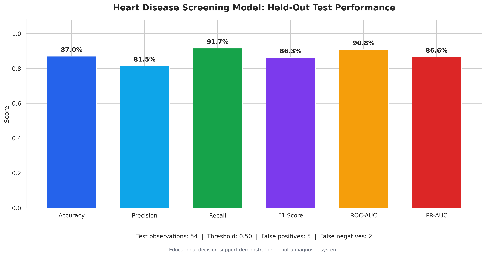
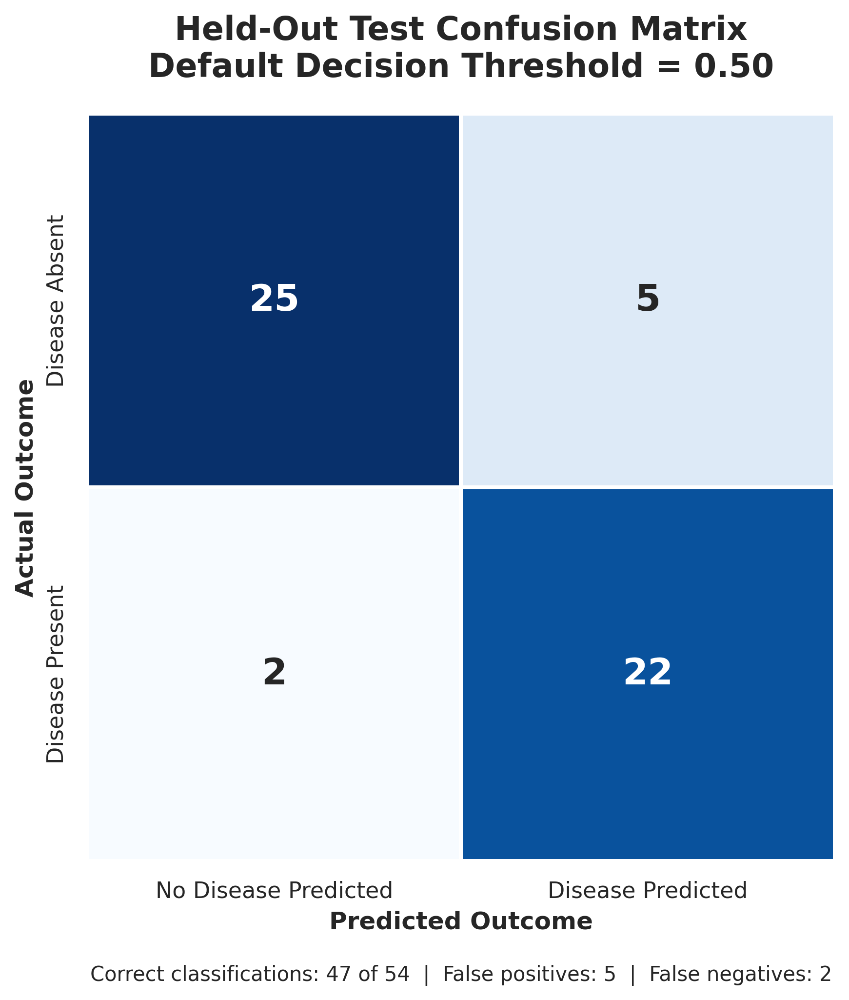
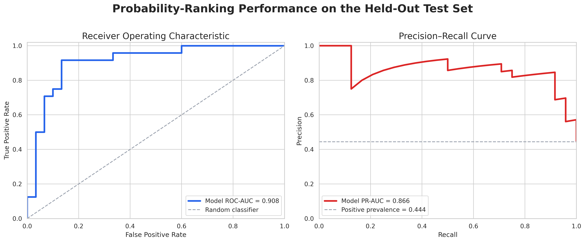
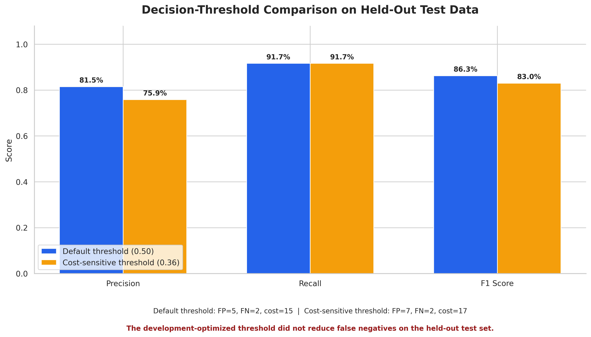

# Cost-Sensitive Heart Disease Screening Decision Support

A responsible machine-learning project that evaluates heart-disease screening as a cost-sensitive classification problem. The project compares multiple models, calibrates predicted probabilities, evaluates alternative decision thresholds, quantifies uncertainty, and demonstrates why development-stage improvements must be validated on unseen data.

> **Responsible-use notice:** This is an educational machine-learning demonstration. It is not a medical device, diagnostic system, medical recommendation, or substitute for evaluation by a qualified healthcare professional.

## Business Question

**Can a machine-learning model help prioritize individuals for further professional assessment while accounting for the greater potential cost of missing a positive case?**

Traditional classification metrics treat every error equally. In a screening context, however, a false negative may carry greater consequences than a false positive. This project therefore evaluates predictive performance using an illustrative relative-cost framework:

- False positive cost: **1**
- False negative cost: **5**

These values are analytical assumptions for demonstration purposes. They are not validated clinical or financial estimates.

## Project Objectives

- Build a reproducible and leakage-safe classification workflow.
- Compare interpretable and ensemble machine-learning models.
- Evaluate discrimination, calibration, and class-sensitive performance.
- Select the decision threshold using development data only.
- Test whether the selected threshold generalizes to unseen data.
- Quantify uncertainty using bootstrap confidence intervals.
- examine model sensitivity using permutation importance.
- Demonstrate an interactive screening interface with responsible-use safeguards.

## Dataset

The project uses the [UCI Statlog Heart dataset](https://archive.ics.uci.edu/dataset/145/statlog+heart), containing 270 observations and 13 predictors.

| Dataset | Rows | Disease Present | Disease Absent |
|---|---:|---:|---:|
| Development | 216 | 96 | 120 |
| Held-Out Test | 54 | 24 | 30 |
| **Total** | **270** | **120** | **150** |

The dataset includes demographic, symptom, physiological, exercise-test, and diagnostic-test variables. It is a small historical dataset and should not be treated as representative of current clinical populations.

## Methodology

### Data Preparation

- Validated the dataset structure, target labels, and missing values.
- Used an 80/20 stratified development and held-out test split.
- Kept the test set isolated until final evaluation.
- Applied median imputation and standardization to numerical predictors.
- Applied most-frequent imputation and one-hot encoding to categorical predictors.
- Contained all preprocessing inside scikit-learn pipelines to reduce leakage risk.

### Model Comparison

The following models were evaluated using repeated stratified five-fold cross-validation:

- Dummy baseline
- Logistic Regression
- Random Forest
- Gradient Boosting

| Model | Accuracy | Precision | Recall | F1 | ROC-AUC | PR-AUC | Brier Score |
|---|---:|---:|---:|---:|---:|---:|---:|
| Logistic Regression | 0.831 | 0.818 | 0.812 | 0.808 | 0.908 | 0.909 | 0.123 |
| Random Forest | 0.827 | 0.821 | 0.796 | 0.802 | 0.914 | 0.916 | 0.124 |
| Gradient Boosting | 0.810 | 0.806 | 0.771 | 0.782 | 0.888 | 0.884 | 0.135 |
| Dummy Baseline | 0.556 | 0.000 | 0.000 | 0.000 | 0.500 | 0.444 | 0.247 |

Logistic Regression was selected because it provided the strongest overall balance of recall, F1 score, accuracy, probability calibration, and interpretability.

Random Forest produced slightly higher ROC-AUC and PR-AUC values, but it had lower recall and F1 performance.

## Probability Calibration

Sigmoid calibration modestly improved the out-of-fold Brier score:

| Probability Model | Out-of-Fold Brier Score |
|---|---:|
| Uncalibrated Logistic Regression | 0.1238 |
| Sigmoid-Calibrated Logistic Regression | 0.1224 |

The calibrated Logistic Regression model was therefore used for threshold analysis and final evaluation.

## Cost-Sensitive Threshold Selection

The decision threshold was selected using out-of-fold development predictions only.

| Decision Rule | Threshold | Precision | Recall | F1 | False Positives | False Negatives | Relative Cost |
|---|---:|---:|---:|---:|---:|---:|---:|
| Default Threshold | 0.50 | 0.837 | 0.750 | 0.791 | 14 | 24 | 134 |
| Minimum-Cost Threshold | 0.36 | 0.748 | 0.896 | 0.815 | 29 | 10 | 79 |

On the development data, the 0.36 threshold appeared to reduce relative cost by approximately 41%.

## Final Held-Out Test Results

The selected calibrated model achieved:

- **ROC-AUC:** 0.908
- **PR-AUC:** 0.866
- **Brier score:** 0.114

| Decision Rule | Threshold | Accuracy | Balanced Accuracy | Precision | Recall | Specificity | F1 | FP | FN | Relative Cost |
|---|---:|---:|---:|---:|---:|---:|---:|---:|---:|---:|
| Default Threshold | 0.50 | 0.870 | 0.875 | 0.815 | 0.917 | 0.833 | 0.863 | 5 | 2 | 15 |
| Cost-Sensitive Threshold | 0.36 | 0.833 | 0.842 | 0.759 | 0.917 | 0.767 | 0.830 | 7 | 2 | 17 |

The development-optimized threshold did **not** generalize to the held-out test set.

Both thresholds identified 22 of the 24 positive cases. However, the 0.36 threshold introduced two additional false positives without reducing the number of false negatives.

The cost-sensitive threshold therefore increased held-out relative cost by 13.3%.

## Key Model-Risk Finding

Threshold optimization can overfit development data.

Although the 0.36 threshold produced a substantial apparent cost reduction during development, it did not improve recall or reduce false negatives on unseen test data. This result was retained and documented rather than hidden.

The project does **not** recommend deploying the 0.36 threshold. The default 0.50 threshold performed better in this test comparison, but it would still require larger-scale external and prospective validation before operational use.

## Portfolio Visuals

### Held-Out Test Performance



### Test-Set Confusion Matrix



### ROC and Precision-Recall Curves



### Decision-Threshold Comparison



## Uncertainty Analysis

Two thousand bootstrap samples were used to estimate uncertainty around the default-threshold test results.

| Metric | Point Estimate | 95% CI Lower | 95% CI Upper |
|---|---:|---:|---:|
| Accuracy | 0.870 | 0.778 | 0.944 |
| Precision | 0.815 | 0.667 | 0.957 |
| Recall | 0.917 | 0.792 | 1.000 |
| F1 | 0.863 | 0.755 | 0.949 |
| ROC-AUC | 0.908 | 0.815 | 0.981 |
| PR-AUC | 0.866 | 0.717 | 0.979 |
| Brier Score | 0.114 | 0.069 | 0.167 |
| Relative Cost | 15.000 | 3.000 | 30.025 |

The relatively wide confidence intervals reflect the small 54-observation test set and reinforce the need for larger validation studies.

## Interpretability

Permutation importance using held-out PR-AUC identified the following as the most influential features in this particular test sample:

1. Chest-pain type
2. Number of major vessels
3. ST depression
4. Resting blood pressure

The importance estimates displayed substantial variability. They should not be interpreted as stable clinical rankings or causal effects.

Negative permutation-importance values observed for some variables indicate sampling instability or feature redundancy, not protective clinical effects.

## Interactive Demonstration

The notebook includes an interactive screening interface that:

- Accepts values for all 13 model inputs.
- Produces an estimated model probability.
- Applies the demonstrated 0.50 threshold.
- Returns a screening route.
- Displays a prominent responsible-use disclaimer.

The interface demonstrates model interaction and decision-support design. Its output is not a diagnosis or medical recommendation.

## Tools and Technologies

- Python
- Pandas
- NumPy
- Scikit-learn
- Matplotlib
- Seaborn
- SciPy
- ipywidgets
- Google Colab

## Project Structure

```text
cost-sensitive-heart-disease-screening/
├── README.md
├── cost-sensitive-heart-disease-screening.ipynb
├── cost-sensitive-heart-disease-screening-report.pdf
└── images/
    ├── README.md
    ├── held-out-test-performance.png
    ├── roc-pr-curves.png
    ├── test-confusion-matrix.png
    └── threshold-comparison.png
