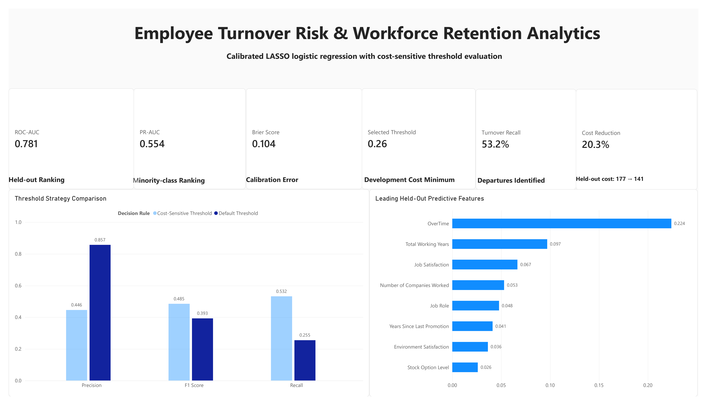

# Employee Turnover Risk & Workforce Retention Analytics

An end-to-end workforce analytics project that uses machine learning and cost-sensitive decision analysis to identify employees at elevated risk of turnover.

The project combines Python modeling with an interactive Power BI dashboard. It focuses on responsible workforce planning—not automated employment decisions.

## Business Question

**Can employee turnover risk be estimated early enough to support targeted retention efforts while balancing missed high-risk employees against unnecessary interventions?**

Employee turnover can create recruitment costs, productivity losses, operational disruption, and knowledge gaps. However, retention resources are limited. This project evaluates both predictive performance and the operational consequences of different decision thresholds.

## Key Results

| Metric | Result |
|---|---:|
| Selected model | Sigmoid-Calibrated LASSO Logistic Regression |
| Held-out ROC-AUC | 0.781 |
| Held-out PR-AUC | 0.554 |
| Brier score | 0.104 |
| Selected threshold | 0.26 |
| Recall at selected threshold | 53.2% |
| Default-threshold relative cost | 177 |
| Selected-threshold relative cost | 141 |
| Estimated cost reduction | 20.3% |

The lower cost-sensitive threshold increased the model’s ability to identify employees at risk of leaving and reduced the estimated operational cost under the project’s stated assumptions.

## Dashboard Highlights

The Power BI dashboard presents:

- Model discrimination and calibration metrics
- Selected employee-risk threshold
- Recall at the selected threshold
- Estimated cost reduction
- Default versus cost-sensitive decision strategies
- Held-out permutation feature importance
- Business interpretation and responsible-use guidance

## Dataset

This project uses the **IBM HR Analytics Employee Attrition & Performance** dataset.

The dataset contains **1,470 fictional employee records** and includes:

- Employee demographics
- Job role and department
- Compensation and stock-option information
- Job satisfaction and work environment
- Overtime and business travel
- Tenure and career progression
- Employee attrition status

Because the dataset is synthetic and educational, the results should not be interpreted as evidence about any real organization or workforce.

## Methodology

### 1. Data Preparation

- Inspected missing values, duplicates, and data types
- Removed non-informative constant fields
- Separated numerical and categorical variables
- Used stratified development and held-out test sets
- Applied preprocessing within machine-learning pipelines to reduce leakage

### 2. Model Development

The following models were compared:

- Dummy baseline
- Logistic regression
- LASSO logistic regression
- Random forest
- Gradient boosting
- RBF support vector machine

Repeated stratified cross-validation was used to evaluate:

- Accuracy
- Balanced accuracy
- Precision
- Recall
- F1 score
- ROC-AUC
- PR-AUC
- Brier score

### 3. Model Selection and Calibration

LASSO logistic regression provided a strong balance of:

- Probability ranking
- Interpretability
- Regularization
- Operational usability

The selected model was calibrated using the sigmoid method to improve the reliability of predicted turnover probabilities.

### 4. Cost-Sensitive Threshold Selection

A probability threshold was selected using development data and an explicit cost framework.

The analysis assigned a higher relative cost to missed turnover cases than to unnecessary retention reviews. Under these assumptions, the selected threshold was **0.26**, compared with the conventional **0.50** threshold.

On the held-out test set, this reduced estimated relative cost from **177 to 141**, representing a **20.3% reduction**.

These costs are analytical assumptions for demonstrating decision analysis—not verified financial estimates from an employer.

### 5. Held-Out Evaluation

The selected model achieved:

- **ROC-AUC:** 0.781
- **PR-AUC:** 0.554
- **Brier score:** 0.104
- **Recall at selected threshold:** 53.2%

These results indicate useful ranking performance, although the model does not identify every employee who leaves. Human review and additional organizational context remain necessary.

## Feature Importance

Held-out permutation importance was used to estimate which variables contributed most to predictive performance.

The results should be interpreted as predictive associations—not causal explanations. A variable that helps predict turnover does not necessarily cause employees to leave.

## Responsible Use

This project is an educational workforce-planning demonstration.

The model should not be used to:

- Make termination, promotion, compensation, or disciplinary decisions
- Automatically label individual employees
- Replace employee feedback or management judgment
- Infer causal explanations for turnover
- Make decisions without fairness, privacy, and legal review

A real deployment would require:

- Current organization-specific data
- Fairness testing across relevant employee groups
- Privacy and access controls
- Human review
- Ongoing monitoring for drift
- Validation of intervention costs and business outcomes

## Tools and Technologies

- Python
- pandas and NumPy
- scikit-learn
- Matplotlib and Seaborn
- Google Colab
- Microsoft Power BI
- Microsoft Excel
- GitHub

## Project Files

| File | Description |
|---|---|
| [Notebook](employee-turnover-workforce-analytics.ipynb) | Complete Python analysis and machine-learning workflow |
| [Power BI Dashboard](employee-turnover-workforce-analytics.pbix) | Interactive workforce-risk dashboard |
| [Dashboard Data](employee-turnover-dashboard-data.xlsx) | Prepared tables used by the Power BI dashboard |
| [Dashboard Image](images/employee-turnover-dashboard.png) | Portfolio-ready dashboard preview |

## How to Run the Project

### 1. Open the Notebook

Open `employee-turnover-workforce-analytics.ipynb` in Google Colab or Jupyter Notebook.

### 2. Install the Dependencies

Run the installation and import cells at the beginning of the notebook.

### 3. Load the Dataset

Upload the IBM HR Analytics employee-attrition dataset when prompted.

### 4. Run the Analysis

Run the notebook cells in order to reproduce:

- Data validation
- Exploratory analysis
- Preprocessing
- Repeated cross-validation
- Probability calibration
- Threshold selection
- Held-out evaluation
- Feature importance
- Dashboard export tables

### 5. Explore the Dashboard

Download and open `employee-turnover-workforce-analytics.pbix` in Microsoft Power BI Desktop.

If Power BI requests a new data source location, connect the report to:

`employee-turnover-dashboard-data.xlsx`

Then refresh the report.

## Main Takeaway

The project demonstrates that model performance alone is not enough for workforce analytics. Threshold selection, probability calibration, business costs, model limitations, and responsible-use safeguards all affect whether a prediction can support a practical decision.

The final model provides a useful employee-risk ranking tool, but its output should serve only as one input into a broader, human-led retention process.
